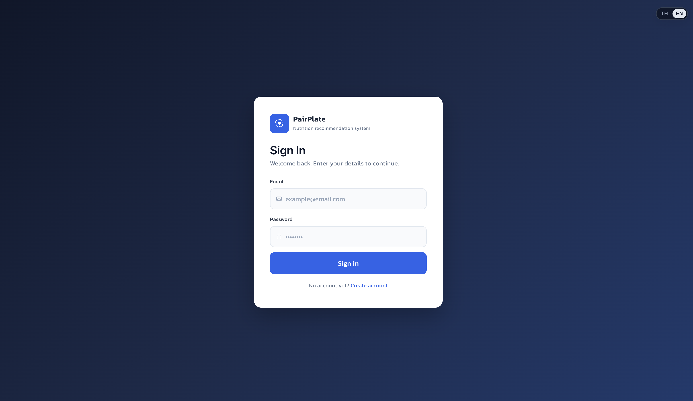
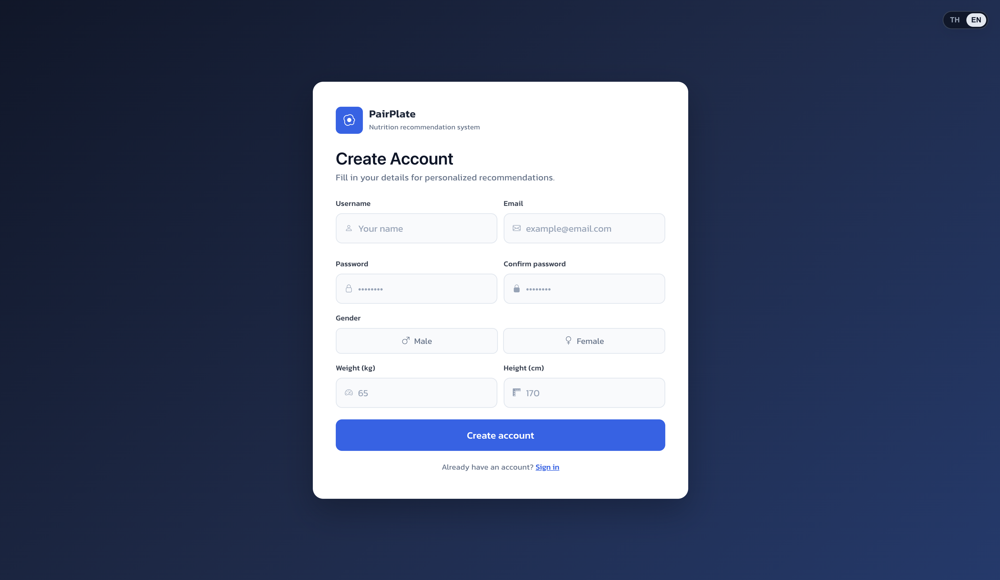
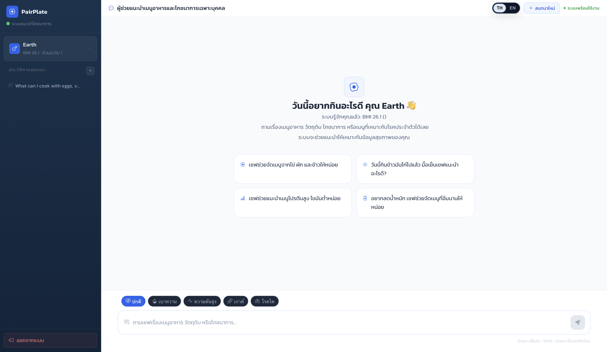
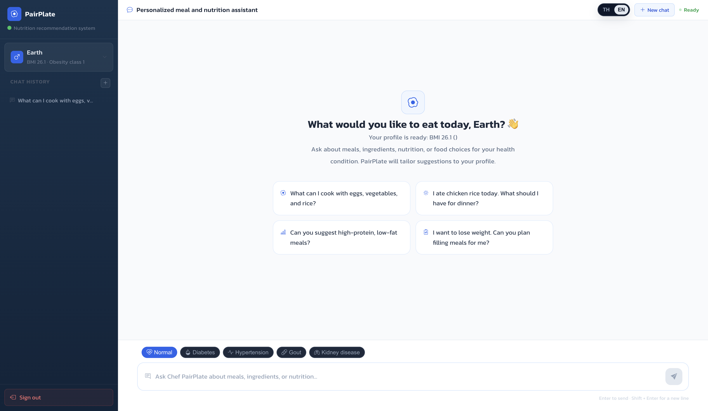
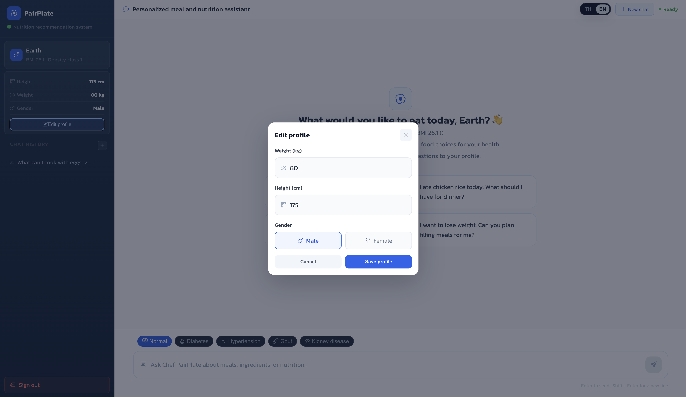

<div align="center">


<br />


<br />
<br />

<p>
  <b>PairPlate - AI Nutrition Chat Assistant</b>
</p>

<p>
  A bilingual AI nutrition assistant that helps users ask about meals, ingredients, nutrition, BMI, and food choices based on personal health conditions.
</p>

<p>
  This public repository is a showcase page only. The production source code is private.
</p>

</div>

<hr />

<h2 align="center">Live Demo Status</h2>

<div align="center">

<table>
  <tr>
    <th>Status</th>
    <td><b>Not publicly released yet</b></td>
  </tr>
  <tr>
    <th>Current Access</th>
    <td>Internal / local testing only</td>
  </tr>
  <tr>
    <th>Purpose</th>
    <td>Portfolio showcase and project overview</td>
  </tr>
</table>

</div>

<p align="center">
  The live demo is not currently open for public testing. Screenshots below are provided to show the system overview and user experience.
</p>

<hr />

<h2 align="center">About This Project</h2>

<p align="center">
  <b>PairPlate</b> is an AI-powered nutrition chat assistant designed to help users make better daily food decisions.
</p>

<p align="center">
  Users can create a personal profile, select a health condition, and ask questions about meals, ingredients, nutrition, or food choices. The assistant uses retrieved food data and health-condition rules to generate practical recommendations.
</p>

<p align="center">
  The system supports both Thai and English interfaces. The chat can automatically respond based on the language used in the user's question.
</p>

<hr />

<h2 align="center">System Overview</h2>

```txt
User
  ↓
React Frontend
  ↓
FastAPI Backend
  ↓
Authentication / User Profile / BMI
  ↓
Health Condition Rules
  ↓
RAG Retrieval from Food & Nutrition Data
  ↓
LLM Response Generation
  ↓
Thai or English AI Nutrition Answer
```

<hr />

<h2 align="center">Application Screenshots</h2>

<h3 align="center">Login Page</h3>

<div align="center">



</div>

<hr />

<h3 align="center">Register Page</h3>

<div align="center">



</div>

<hr />

<h3 align="center">Thai Chat</h3>

<div align="center">



</div>

<hr />

<h3 align="center">English Chat</h3>

<div align="center">



</div>

<hr />

<h3 align="center">Profile and Sidebar</h3>

<div align="center">



</div>

<hr />

<h2 align="center">Features</h2>

<table align="center">
  <tr>
    <th>Feature</th>
    <th>Description</th>
  </tr>
  <tr>
    <td><b>AI Nutrition Chat</b></td>
    <td>Users can ask food, ingredient, meal planning, and nutrition questions.</td>
  </tr>
  <tr>
    <td><b>Thai / English UI</b></td>
    <td>The interface supports both Thai and English.</td>
  </tr>
  <tr>
    <td><b>Auto Language Response</b></td>
    <td>The chatbot responds based on the language used in the user's question.</td>
  </tr>
  <tr>
    <td><b>User Authentication</b></td>
    <td>Users can register, log in, and manage their own chat sessions.</td>
  </tr>
  <tr>
    <td><b>Personal Health Profile</b></td>
    <td>The system stores gender, weight, height, BMI, and selected health condition.</td>
  </tr>
  <tr>
    <td><b>Health-Aware Suggestions</b></td>
    <td>Recommendations are adjusted for conditions such as diabetes, hypertension, gout, and kidney disease.</td>
  </tr>
  <tr>
    <td><b>Chat History</b></td>
    <td>Users can continue previous chat sessions.</td>
  </tr>
  <tr>
    <td><b>RAG Workflow</b></td>
    <td>Food and nutrition datasets are used as retrieval context before generating AI responses.</td>
  </tr>
  <tr>
    <td><b>Demo Usage Limit</b></td>
    <td>The backend includes a daily question limit to help protect free-tier API usage.</td>
  </tr>
</table>

<hr />

<h2 align="center">Supported Health Conditions</h2>

<div align="center">

<table>
  <tr>
    <th>Condition</th>
    <th>Purpose</th>
  </tr>
  <tr>
    <td>Normal</td>
    <td>General balanced meal recommendations</td>
  </tr>
  <tr>
    <td>Diabetes</td>
    <td>Lower sugar and more balanced carbohydrate guidance</td>
  </tr>
  <tr>
    <td>Hypertension</td>
    <td>Lower sodium and heart-conscious food suggestions</td>
  </tr>
  <tr>
    <td>Gout</td>
    <td>Food suggestions with purine-related caution</td>
  </tr>
  <tr>
    <td>Kidney Disease</td>
    <td>Careful nutrition warnings and medical consultation reminders</td>
  </tr>
</table>

</div>

<hr />

<h2 align="center">Built With</h2>

<div align="center">

<table>
  <tr>
    <td align="center"><b>Frontend</b></td>
    <td align="center">React</td>
    <td align="center">Vite</td>
    <td align="center">Axios</td>
    <td align="center">CSS</td>
  </tr>
  <tr>
    <td align="center"><b>Backend</b></td>
    <td align="center">FastAPI</td>
    <td align="center">Python</td>
    <td align="center">SQL Server</td>
    <td align="center">JWT Auth</td>
  </tr>
  <tr>
    <td align="center"><b>AI / RAG</b></td>
    <td align="center">Groq API</td>
    <td align="center">ChromaDB</td>
    <td align="center">Sentence Transformers</td>
    <td align="center">CSV Dataset</td>
  </tr>
</table>

</div>

<hr />

<h2 align="center">Project Flow</h2>

<table align="center">
  <tr>
    <th>Step</th>
    <th>Process</th>
    <th>Description</th>
  </tr>
  <tr>
    <td>1</td>
    <td><b>User Login</b></td>
    <td>The user logs in or creates an account.</td>
  </tr>
  <tr>
    <td>2</td>
    <td><b>Profile Setup</b></td>
    <td>The system stores user health profile information and calculates BMI.</td>
  </tr>
  <tr>
    <td>3</td>
    <td><b>Ask Question</b></td>
    <td>The user asks a food or nutrition question in Thai or English.</td>
  </tr>
  <tr>
    <td>4</td>
    <td><b>Retrieve Context</b></td>
    <td>The backend retrieves relevant food and nutrition information from datasets.</td>
  </tr>
  <tr>
    <td>5</td>
    <td><b>Apply Health Rules</b></td>
    <td>The system checks health-condition rules and warnings.</td>
  </tr>
  <tr>
    <td>6</td>
    <td><b>Generate Answer</b></td>
    <td>The LLM generates a practical nutrition response.</td>
  </tr>
  <tr>
    <td>7</td>
    <td><b>Return Response</b></td>
    <td>The response is shown in the same language as the user's question.</td>
  </tr>
</table>

<hr />

<h2 align="center">Repository Notice</h2>

<p align="center">
  This repository is a <b>public showcase repository</b>. It does not contain the full application source code, API keys, database credentials, or private datasets.
</p>

<p align="center">
  The full source code is kept private for security and project ownership reasons.
</p>

<hr />

<h2 align="center">Data Notice</h2>

<p align="center">
  The original system uses food and nutrition CSV datasets for retrieval. Large data files are not included in this public showcase repository.
</p>

<p align="center">
  Production data should be stored securely using private storage, cloud storage, a database, or deployment-specific volumes.
</p>

<hr />

<h2 align="center">Medical Disclaimer</h2>

<p align="center">
  PairPlate provides general nutrition information only. It does not diagnose medical conditions, prescribe treatments, or replace advice from doctors or registered dietitians.
</p>

<p align="center">
  Users with medical conditions should consult healthcare professionals before making significant dietary changes.
</p>

<hr />

<h2 align="center">Contact</h2>

<p align="center">
  If you are interested in this system, want to discuss the project, or would like more information, please contact:
</p>

<p align="center">
  <b>earthcraftchallenge@gmail.com</b>
</p>

<hr />

<div align="center">


</div>
